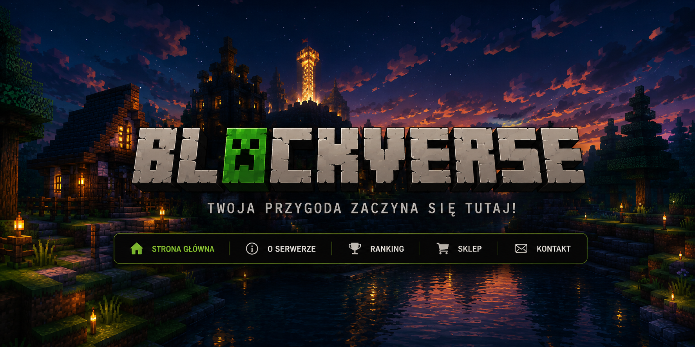
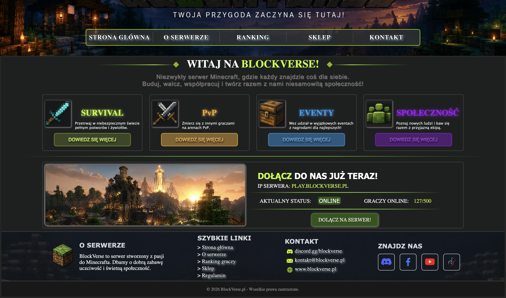

# 🎮 BlockVerse Website

> Minecraft-inspired landing page created as my first Front-End project.

---

## 🖼️ Preview

---

## 📖 About

BlockVerse Website is a responsive landing page inspired by Minecraft servers.

This project was built to practice HTML, CSS, Git and GitHub while learning front-end development.

---

## 🛠️ Technologies

- HTML5
- CSS3
- Git
- GitHub

---

## 📸 Screenshots

  
  

---

## 👨‍💻 Author

GitHub: [@adu-devx](https://github.com/adu-devx)